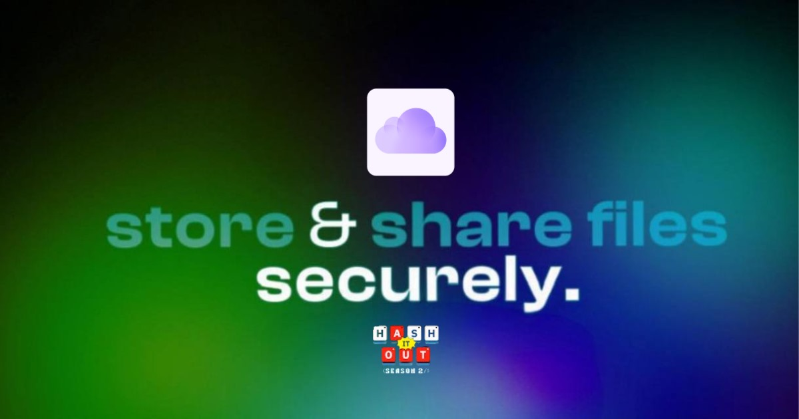

Got it! Here's the updated version with the name changed to **StoriX**:

---

  
    
  
  
  

 

# 🚀 StoriX Beta

Decentralized Cloud Storage Powered by IPFS, with Enhanced User experience 

## 💡 About StoriX

In an age where our data is controlled by large corporations, Web 3.0 introduces a new paradigm of decentralization—allowing the storage and flow of data without relying on a central authority.

StoriX embodies this vision, providing the most secure personal cloud storage solution through decentralized technologies. By leveraging the InterPlanetary File System (IPFS) and blockchain, StoriX enables users to upload, store, and share their files with enhanced security and privacy, all while offering a seamless user experience.

## ⭐ Key Features

- **Effortless File Storage:** Upload any file type directly onto the Polygon network via an intuitive interface.
- **End-to-End Encryption:** Your files are encrypted and secure, eliminating concerns about data piracy.
- **Seamless Sharing:** Easily share your files on-chain with other users.
- **Blockchain Powered:** Built on blockchain technology to ensure transparency and immutability.

## 🌠 Technologies

- **Frontend:** Next.js (React Framework)
- **UI:** Chakra UI (for a sleek, responsive user experience)
- **Blockchain:** Polygon Network
- **File Storage:** IPFS & Filecoin
- **Domain Management:** ENS (Ethereum Name Service)
- **Push Notifications:** Push Protocol
- **Infrastructure:** Infura, Thirdweb
- **External Libraries:** Various JavaScript Libraries for enhanced functionality

## 📜 Smart Contract

The StoriX contract is now deployed on the **Sepolia Ethereum Testnet**. 

- **Contract Address:** [0x2e030A7a4Dc8a4b2e510B3fA116EbAAa7e967C8f](https://sepolia.etherscan.io/address/0x2e030A7a4Dc8a4b2e510B3fA116EbAAa7e967C8f
- 
